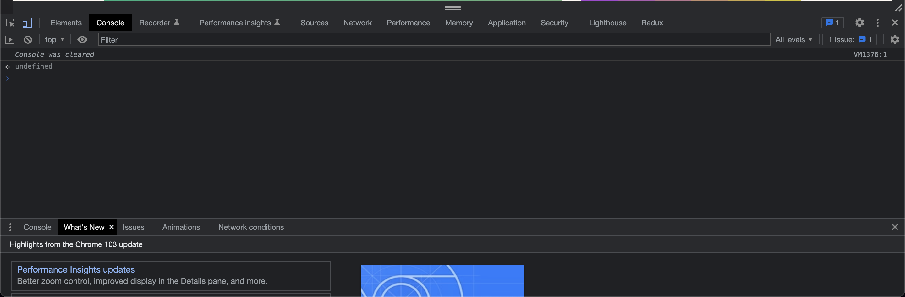
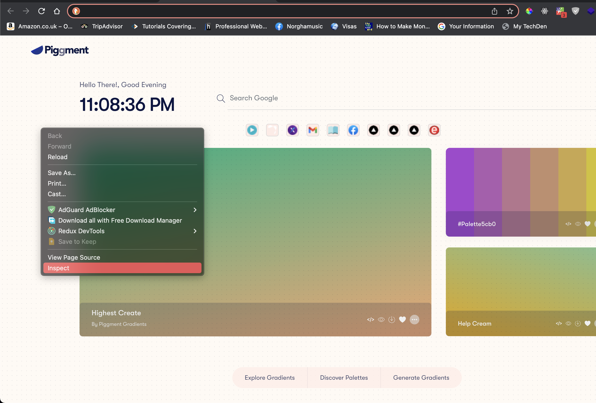
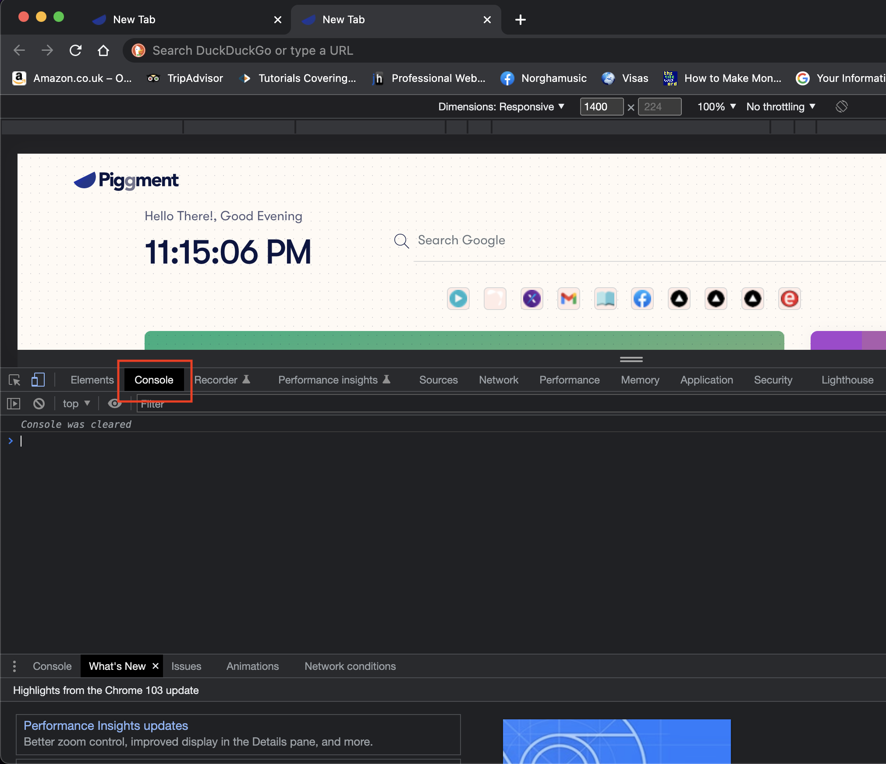
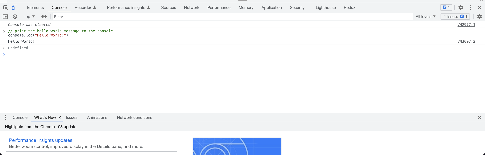
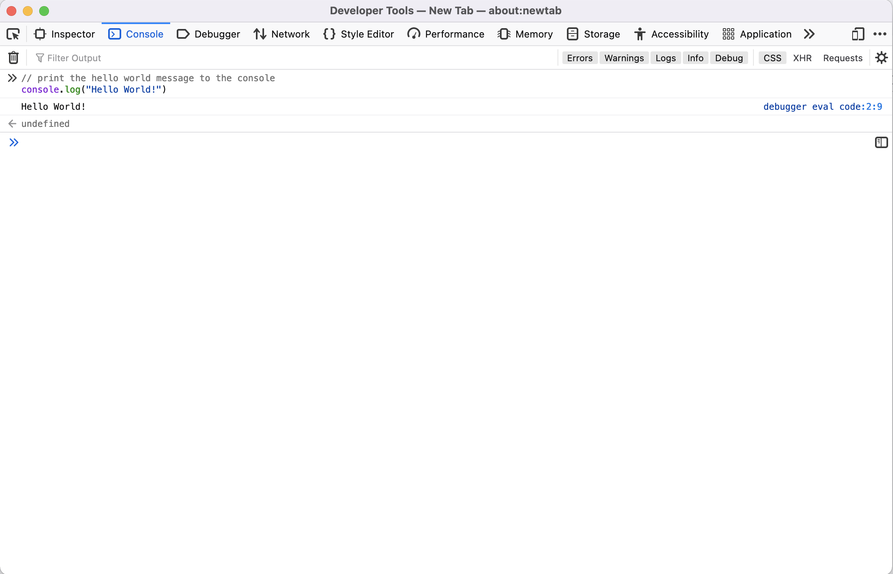

## **Setting up and running Javascript**

### **Running Javascript using Web Developer Tools**

Javascript powers the web through modern web browsers. Every Web browser out there come with the Latest stable Javascript pre-installed. This allows the web browser to run Javascript code in web applications. 

In this tutorial, I will guide you through how you can run write and execute Javascript code in the browser using the most popular web browsers on the Internet. Let me state that if your favourite browser is not covered in this tutorial, do not panic, because the techniques we will use here are applicable to most modern browsers. All you need to do is search how you can find Developer tools on the browser and viola. The browsers we will talk about are Google Chrome, Mozilla Firefox, Safari, Microsoft Edge and Brave Browser.

### **Google Chrome and Brave Browser**

Google chrome is one of the most popular browsers out there, which has won the hearts of a lot of developers. If you don’t have google chrome on your machine, you need to install and have it running before we can proceed.

Once you have google chrome installed, it comes with devtools already whipped into the browsers, so we are just going straight into where we can find the chrome browser console.

There are two ways you can navigate to the console; 

- Using the keyboard shortcuts to open the dev console. To do this, you need to open your chrome browser first, then press `F12` on windows OS or `Cmd+Opt+J` on Mac. This will open the developer tools console directly and it will like this;



- Before we start typing code, let me show you the other way to get to the dev console. Open your chrome browser, right click or double click on your mouse or mouse pad, now click on `inspect` on the popup like in the picture below;



Now the developer tools will open, click on the console tab. This will take you to the devtools console.



Now we are ready to start typing Javascript in the browser. 

For example; let try to print out a simple “Hello World” Message in the console. Copy the code below and paste in the console.

<aside>
💡 **Note:** ignore the message “*Console was cleared”* in my console. I have a couple. chrome extensions which add some Javascript code in the console once I open it, so to have a clean slate for this tutorial, I had to clear it. If you see a bunch of Javascript code in your console, and wish to clear it. Run `clear()` and press enter, this will clear the console for you.

</aside>

```jsx
// print the hello world message to the console
console.log("Hello World!")
```

Now press `Enter` or `return` on your keyboard. The results will be `Hello World!` . Don’t worry if you don’t understand how the code works, in this course, I will have an in-depth discussion with you on how this whole thing works.



### Firefox and Edge

- To use keyboard shortcuts to open console on Firefox and Edge, press `Ctrl + Shift+ I` or `F12` on Windows and Linux, or `Cmd+Opt+I` on macOS.
- Or open a new empty tab on your browser, right click or double click on your mouse or mouse pad respectively, select inspect on the popup, once the devtools open, navigate to the console tab. You will arrive at the dev console. See the image below;

